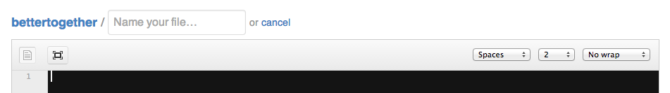
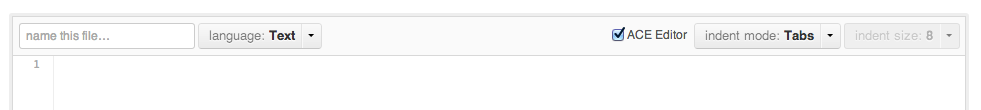

<title>Let's Make GitHub Better, Together</title>
<meta charset="utf-8">
<link href="//netdna.bootstrapcdn.com/twitter-bootstrap/2.2.1/css/bootstrap-combined.min.css" rel="stylesheet">

// TODO: Gotta embed this into the source somehow:
// 

GitHub, I ❤ You Too
=============================================
But you've got some issues. And I want to help you fix them.

GitHub Mac App can enter a bad state if sidebar is extended too far
-------------------------------------------------------------------

<video controls src="./video/github_mac_app_resizing_bug.mov"></video>

**Fix:** Set a limit on how far out the sidebar can extend, to avoid this problematic state from ever occurring.

Gists that have zero stars have a broken link (404)
---------------------------------------------------

<video controls src="./video/gist_zero_stars_leads_to_404.mov"></video>

**Fix:** When there are zero stars, link to <u>https://gist.github.com/`username`/`gist_id`/stars</u> rather than <u>https://gist.github.com/`username`/false</u>.

Different defaults for indent settings all over the place
---------------------------------------------------------

**Fix:** Make consistent default values for indent mode and indent size.

**Pro-level:** If your defaults aren't my preferred values, please let me [override](https://github.com/shurcooL/preferences.content/blob/master/README.toml) the defaults in my GitHub settings. Personally, I like tabs of size 4.
